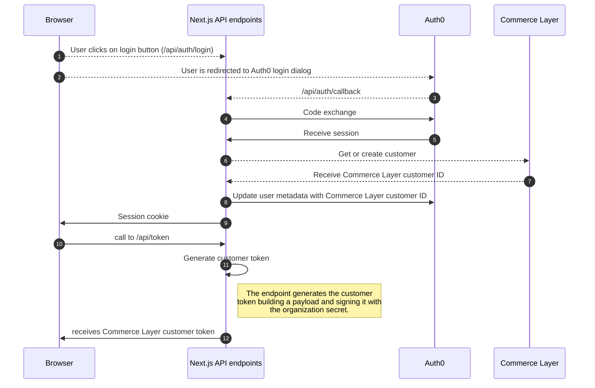

# SSO with Next.js, Auth0, and Commerce Layer

This example shows you how to integrate [Auth0 Next.js SDK](https://github.com/auth0/nextjs-auth0) into a Next.js application created using [create-next-app](https://nextjs.org/docs/api-reference/create-next-app). You can use it as a reference to build an SSO flow with Commerce Layer. The sample is a companion to the [Auth0 Next.js SDK Quickstart](https://auth0.com/docs/quickstart/webapp/nextjs). To get started, kindly read [this comprehensive tutorial](https://commercelayer.io/blog/how-to-single-sign-on-with-nextjs-auth0-and-commerce-layer) on our blog.

---

## Quick start guide

This sample covers the following use cases:

- [Login](https://github.com/commercelayer/sample-nextjs-auth0-sso/blob/main/components/NavBar.jsx#L61-L67)
- [Logout](https://github.com/commercelayer/sample-nextjs-auth0-sso/blob/main/components/NavBar.jsx#L93-L95)
- [Showing the user profile](https://github.com/commercelayer/sample-nextjs-auth0-sso/blob/main/pages/profile.jsx)
- [Protecting client-side rendered pages](https://github.com/commercelayer/sample-nextjs-auth0-sso/blob/main/pages/profile.jsx#L43-L46)
- [Showing Commerce Layer product and price on the homepage](https://github.com/commercelayer/sample-nextjs-auth0-sso/blob/main/components/Content.jsx)
- [Showing Commerce Layer user's order history](https://github.com/commercelayer/sample-nextjs-auth0-sso/blob/main/pages/orders.jsx)



The diagram above outlines the steps involved in the customer *sign-up/sign-in* process and the acquisition of a customer token, which grants access to Commerce Layer functionality.

1. The user clicks on the login button.
2. The Next.js endpoint (`/api/auth/login`) redirects to the Auth0 Login Dialog.
3. After successful authentication, Auth0 calls the `/api/auth/callback` endpoint with a code.
4. The Next.js endpoint exchanges the code with Auth0.
5. Auth0 replies with an access token and an ID token.
6. Using a Commerce Layer integration application, the customer is retrieved or created on Commerce Layer based on their email.
7. The customer ID is received from Commerce Layer.
8. The user metadata on Auth0 is updated with the customer ID provided by Commerce Layer using an Auth0 M2M application.
9. An Auth0 session is created on the browser.
10. The protected endpoint `/api/token` can now be called as the user is logged in with Auth0.
11. The customer ID is retrieved from the user's metadata on Auth0 using an Auth0 M2M application and is used to build the payload for the access token. Using the organization's shared secret, the JWT is generated.
12. The customer token is retrieved on the frontend, allowing the user to interact with Commerce Layer APIs as the customer.

## Project setup

Use `pnpm` to install the project dependencies:

```bash
pnpm install
```

## Configuration

This example uses Auth0, an easy-to-implement, adaptable authentication and authorization platform. Auth0 helps you to:

- Add authentication with [multiple sources](https://auth0.com/docs/identityproviders), either social identity providers such as Google, Facebook, Microsoft Account, LinkedIn, GitHub, Twitter, Box, Salesforce (amongst others), or enterprise identity systems like Windows Azure AD, Google Apps, Active Directory, ADFS, or any SAML Identity Provider.
- Add authentication through more traditional [username/password databases](https://auth0.com/docs/connections/database/custom-db).
- Add support for [linking different user accounts](https://auth0.com/docs/users/user-account-linking) with the same user.
- Support for generating signed [JSON Web Tokens](https://auth0.com/docs/tokens/json-web-tokens) to call your APIs and flow the user identity securely.
- Analytics of how, when, and where users are logging in.
- Pull data from other sources and add it to the user profile through [JavaScript rules](https://auth0.com/docs/rules).

To get started, create a free Commerce Layer account like so:

1. Sign up [here](https://dashboard.commercelayer.io/sign_up).
2. Use Google, GitHub, or your email+password credentials to log in.

Also, create a free Auth0 account like so:

1. Go to the [Auth0 homepage](https://auth0.com) and click *Sign Up*.
2. Use Google, GitHub, or Microsoft Account to log in.

### Credentials

#### Auth0

The project needs to be configured with your Auth0 domain, client ID, and client secret for the authentication flow to work.

To do that, first copy `.env.local.example` into a new file in the same folder called `.env.local`, and replace the values with your own Auth0 application credentials (more info about loading environmental variables in Next.js [here](https://nextjs.org/docs/basic-features/environment-variables)):

```sh
# A long secret value used to encrypt the session cookie
AUTH0_SECRET='LONG_RANDOM_VALUE'
# The base URL of your application
AUTH0_BASE_URL='http://localhost:3000'
# The URL of your Auth0 tenant domain
AUTH0_ISSUER_BASE_URL='https://YOUR_AUTH0_DOMAIN.auth0.com'
# Your Auth0 application's client ID
AUTH0_CLIENT_ID='YOUR_AUTH0_CLIENT_ID'
# Your Auth0 application's client secret
AUTH0_CLIENT_SECRET='YOUR_AUTH0_CLIENT_SECRET'
# Your Auth0 API's identifier
# OMIT if you do not want to use the API part of the sample
AUTH0_AUDIENCE='YOUR_AUTH0_API_IDENTIFIER'
# The permissions your app is asking for
# OMIT if you do not want to use the API part of the sample
AUTH0_SCOPE='openid profile email'
```

> **Note**<br />
> Make sure you replace `AUTH0_SECRET` with your own secret (you can generate a suitable string using `openssl rand -hex 32` on the command line).

Add a new Machine to Machine application and add to `.env.local` the following variables:

```sh
AUTH0_M2M_CLIENT_ID='YOUR_AUTH0_M2M_CLIENT_ID'
AUTH0_M2M_CLIENT_SECRET='YOUR_AUTH0_M2M_CLIENT_SECRET'
```

#### Commerce Layer

You also need to use a [sales channel](https://docs.commercelayer.io/core/applications#sales-channel) and an [integration](https://docs.commercelayer.io/core/applications#integration) application on Commerce Layer. Add to `.env.local` the following variables setting your applications' credentials and organization/market information:

```sh
CL_INTEGRATION_CLIENT_ID='-IzV5WEN6CLi3LoYw7ObGpHMD67zsVUf1hoZXmMDeFo'
CL_INTEGRATION_SECRET='KuzqWg9nfLTJmjlEkgdwyap0RMQK6wLBpIRvgaZVgdU'
CL_SHARED_SECRET=A0B82CF3799FCFC4282523221BB170112F3ABD2AF03BD0D77FC296D6603746E8

NEXT_PUBLIC_CL_SALES_CHANNEL_ID='YOUR_SALES_CHANNEL_APPLICATION_ID'
NEXT_PUBLIC_CL_SALES_CHANNEL_CLIENT_ID='YOUR_SALES_CHANNEL_CLIENT_ID'
NEXT_PUBLIC_CL_MARKET='YOUR_MARKET_NUMBER'
NEXT_PUBLIC_CL_MARKET_ID='YOUR_MARKET_ID'
NEXT_PUBLIC_CL_PRICE_LIST_ID='YOUR_PRICE_LIST_ID'
NEXT_PUBLIC_CL_STOCK_LOCATION_IDS='YOUR_STOCK_LOCATIONS_IDS'
NEXT_PUBLIC_CL_ENDPOINT='YOUR_ORGANIZATION_SLUG'
NEXT_PUBLIC_CL_ORGANIZATION_ID='YOUR_ORGANIZATION_ID'
```

You can find a few of them running the project and taking a look at the browser console.

## Running the sample

### Development

Run the following command to compile and serve the Next.js app, starting the API server on port `3001` with hot-reload:

```bash
pnpm run dev
```

### Production

Run the following command to compile and minify the Next.js app, ready for production:

```bash
npm run build
```

### Docker build

To build and run the Docker image, run `exec.sh`, or `exec.ps1` on Windows.

## License

This project is licensed under the MIT license. See the [LICENSE](./LICENSE) file for more info.
