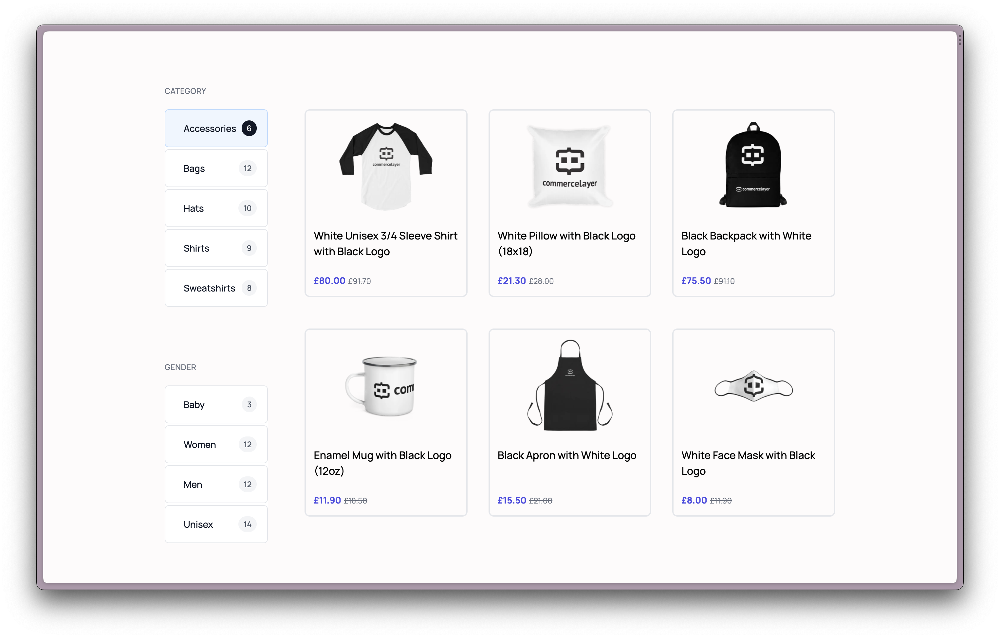
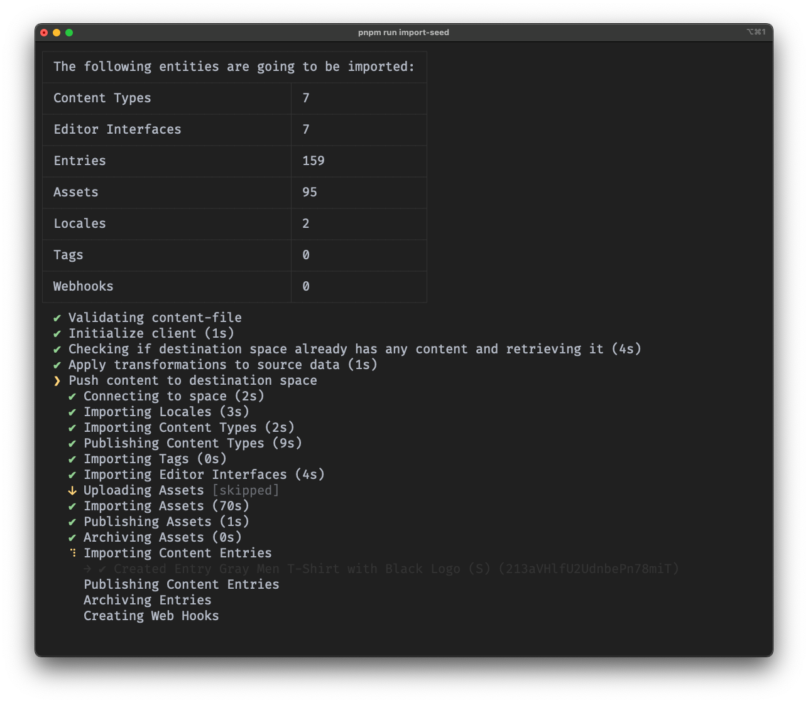

# Commerce Layer Nextjs Contentful Store

A multi-country ecommerce store built with Commerce Layer, Next.js, and Contentful. You can explore the live demo [here](https://cl-nextjs-contentful-store.netlify.app).

[](https://cl-nextjs-contentful-store.netlify.app)

---

## Features

- A user-friendly and performant ecommerce storefront (with products, taxonomies, i18n, cart, checkout, etc.) built with TypeScript, Nextjs, [Commerce Layer React Components](https://github.com/commercelayer/commercelayer-react-components) library, and Tailwind CSS.
- International transactional functionalities powered by [Commerce Layer](https://commercelayer.io) API (including commerce seed data powered by [Commerce Layer CLI Seeder](https://github.com/commercelayer/commercelayer-cli-plugin-seeder/blob/main/README.md) plugin).
- CMS integration powered by Contentful (including seed content models and assets data).
- PSD2-compliant and production-ready [cart](https://github.com/commercelayer/commercelayer-cart) / [checkout](https://github.com/commercelayer/commercelayer-react-checkout) functionality.
- React18 and Next13 support.
- Type-checking and code linting.
- Localization support (including Italian and French translations).
- SEO and progressive web application (PWA) support.
- Comprehensive installation and usage documentation.
- One-click deployment configuration to your favorite hosting providers.

| [Storefront UI](https://cl-nextjs-contentful-store.netlify.app)    | [Contentful Editor](https://app.contenful.com)             |
| ----------------------- | ------------------------------ |
|         |   |

## Important Files and Folders

| **Path**                     |   **Description**                   |
| ---------------------------- | ----------------------------------- |
| `.env.local.sample`          | Example file with all the required environment variables.                                               |  
| `/components`                | React components for the storefront. |
| `/locale/index.ts`           | Config file for the storefront's transalations (`en-US`, `it-IT`, and `fr-FR`).                       |
| `/hooks/GetToken.ts`         | Hooks file to fetch a salesChannel token from Commerce Layer and save as a cookie.                      |
| `/pages/[countryCode]/[lang]/index.tsx`     | Index page for the storefront (country selector and product listing).                   |
| `/pages/[countryCode]/[lang]/[product].tsx` | Page for all product items (image, product information, and variant selection).           |
| `/pages/[countryCode]/[lang]/cart.tsx` | Cart page for for the storefront with link to checkout.                                    |
| `/utils/contentful/api.ts`   | Where all data from Contentful is fetched and parsed using Contentful's JavaScript Client.             |  
| `/data`                      | Exported content data to seed your contentful space with.                                               |  

## Getting Started

The quickest way to get up and running is to use any of the deploy buttons below to set up and deploy automatically to your favorite hosting provider. Afterward, you will add some seed data to Commerce Layer and Contentful. The deploy button will clone this repository and ask you to enter all the required environment variables. Alternatively, you can clone this repository, configure the template, import the dataset into your Contentful space, import some seed commerce data into your Commerce Layer organization, and deploy your application. The installation guide below will show you how to achieve this.

[](https://app.netlify.com/start/deploy?repository=https://github.com/commercelayer/examples&base=cms/nextjs-contentful-store#BUILD_LANGUAGES=en-US,it-IT&NEXT_PUBLIC_SITE_NAME&NEXT_PUBLIC_SITE_URL&NEXT_PUBLIC_CL_CLIENT_ID&NEXT_PUBLIC_CL_ENDPOINT&NEXT_PUBLIC_CONTENTFUL_SPACE_ID&NEXT_PUBLIC_CONTENTFUL_DELIVERY_ACCESS_TOKEN) [](https://vercel.com/new/clone?repository-url=https%3A%2F%2Fgithub.com%2Fcommercelayer%2Fexamples%2Fblob%2Fmain%2Fcms%2Fnextjs-contentful-store&env=BUILD_LANGUAGES=en-US,it-IT,NEXT_PUBLIC_SITE_NAME,NEXT_PUBLIC_SITE_URL,NEXT_PUBLIC_CL_CLIENT_ID,NEXT_PUBLIC_CL_ENDPOINT,NEXT_PUBLIC_CONTENTFUL_SPACE_ID,NEXT_PUBLIC_CONTENTFUL_DELIVERY_ACCESS_TOKEN&envDescription=API%20credentials%20and%20configuration%20variables%20needed%20for%20the%20store.&envLink=https%3A%2F%2Fgithub.com%2Fcommercelayer%2Fexamples%2Fblob%2Fmain%2Fcms%2Fnextjs-contentful-store%23installation-guide)

### Installation Guide

1. Clone this repository ([learn how to do this](https://docs.github.com/en/github/creating-cloning-and-archiving-repositories/cloning-a-repository)).

2. Rename the `/env.local.example` file to `.env.local` and add the following credentials:

| **Variable**                | **Description**                    |
| --------------------------- | ---------------------------------- |
| `BUILD_LANGUAGES`           | The supported locales (the default is `en-US, it-IT, fr-FR`).                                            |
| `NEXT_PUBLIC_SITE_NAME`     | Optional name for the `<title>` head tag (you can also edit this directly in the code).                 |
| `NEXT_PUBLIC_SITE_URL`      | Optional URL of your deployed project for the `og:url` meta property and cart `return_url` (you can also edit this directly in the code).                                        |
| `NEXT_PUBLIC_CL_CLIENT_ID`  | Your Commerce Layer sales channels application client ID (you can create this automatically by following this [onboarding guide](https://docs.commercelayer.io/developers) or manually on the [Commerce Layer dashboard](https://dashboard.commercelayer.io)).                                                |
| `NEXT_PUBLIC_CL_ENDPOINT`   | Your Commerce Layer organization's base endpoint (you can copy this on the [Commerce Layer dashboard](https://dashboard.commercelayer.io)).                                      |
| `NEXT_PUBLIC_CONTENTFUL_SPACE_ID`   | Your Contentful space ID (you can get this from [app.contentful.com](https://app.contentful.com)).                                                             |
| `NEXT_PUBLIC_CONTENTFUL_DELIVERY_ACCESS_TOKEN` | Your Contentful delivery access token (you can get this from [app.contentful.com](https://app.contentful.com)).                                     |

3. Run the command below to install the required dependencies:

```bash
pnpm install
```

4. Run the command below to start the development server:

```bash
pnpm run dev
```

This will run the storefront at `localhost:3000`.

### Import Seed Commerce Layer Data

1. Create a free [Commerce Layer account](https://dashboard.commercelayer.io/sign_up). If you already have an active account, kindly skip to Step 3.

2. Create a new [organization](https://commercelayer.io/docs/data-model/users-and-organizations) or follow the [onboarding tutorial guide](https://docs.commercelayer.io/developers).

3. Create a new **Integrations** application with **Name** set to `CLI` and **Role** set to `admin`.

4. In your newly created application, copy the `Client ID`, `Client secret`, and `Base endpoint` credentials.

5. Install the [Commerce Layer CLI](https://github.com/commercelayer/commercelayer-cli) which is available as an [npm package](https://www.npmjs.com/package/@commercelayer/commercelayer-cli) or [yarn package](https://yarnpkg.com/package/@commercelayer/cli) using the command below:

```bash
npm install -g @commercelayer/cli
```

or

```bash
yarn global add @commercelayer/cli
```

6. Log into your application via the CLI using the previously created CLI credentials like so:

```bash
cl applications:login -o <organizationSlug> -i <clientId> -s <clientSecret> -a <applicationAlias>
```

7. Install the [seeder plugin](https://github.com/commercelayer/commercelayer-cli-plugin-seeder/blob/main/README.md) using the command below:

```bash
cl plugins:install seeder
```

8. Run the command below to import three demo [markets](https://data.commercelayer.app/seed/markets.json) (UK, USA, and Europe), a set of [SKUs](https://data.commercelayer.app/seed/skus.json), related [price lists](https://data.commercelayer.app/seed/price_lists.json), related [prices](https://data.commercelayer.app/seed/prices.json), [stock locations](https://data.commercelayer.app/seed/stock_locations.json), and [inventory](https://data.commercelayer.app/seed/stock_items.json) into your organization using the `multi_market` [business model](https://commercelayer.io/docs/data-model/markets-and-business-models).

```bash
cl seed -b multi_market
```

9. To see the commands for other seeder options, type the command below:

```bash
cl --help
```

### Import Seed Contentful Data

This template was developed with a Contentful content model that looks like the table below:

| **Content model**                         | **Fields**                     |
| ------------------------------------ | ----------------------------------- |
| `Catalog` | Name and Taxonomies. |
| `Country` | Name, Code, Catalog, Market ID, Image, Default Locale, and Domain. |
| `Product` | Name, Description, Slug, Reference, Images, and Variants. |
| `Size` | Name. |
| `Taxon` | Name, Label, Slug, Description, Images, Products, and Taxons. |
| `Taxonomy` | Name, Label, and Taxons. |
| `Variant` | Name, Code, Description, Images, Size, and Bundle. |

Kindly follow the steps below to add the exported data (structured text and image files for all the content models). This data will match the commerce data in Commerce Layer (SKUs, prices, etc.).

1. Install the Contentful CLI using the command below:

```bash
npm install -g contentful-cli
```

or

```bash
yarn global add contentful-cli
```

2. Log into your Contentful account using the command below:

```bash
contentful login
```

A browser window will then open where you will log in and authorize the CLI with the generated CMA token.

3. In the `/data` folder, you will find an `example-config.json` file. Edit the file and add your space ID and management token like so:

```json
{
  "spaceId": "SPACE_ID",
  "managementToken": "MANAGEMENT_TOKEN",
  "contentFile": "data/contentful-seed.json"
}
```

3. In the `/data` folder, you will find a `contentful-seed.json` file that includes export data from the Contentful space used to build this template. The exported JSON file has the following structure:

```json
{
  "contentTypes": [],
  "entries": [],
  "assets": [],
  "locales": [],
  "webhooks": [],
  "roles": [],
  "editorInterfaces": []
}
```

4. Now, run the command below to import the seed file into your Contentful space

```bash
contentful space import --config data/example-config.json
```

5. Check your Contentful space in the dashboard to preview the imported content models and data.

<br />



<br />

> **Note**
>
> The Contentful content data includes a collection of sample countries, products, variants, sizes, taxons, taxonomies, catalogs, and product images created during development. To get an [access token](https://docs.commercelayer.io/developers/authentication) for the Nextjs storefront, we fetch the scope (market ID) from the `Market Id` attribute set in the Contentful `Country` content model.
>
> So, when you seed your Commerce Layer organization, some markets will be created with a different market ID from the one imported into Contentful. Hence, you will need to fetch the valid market scope's number (4 digits) from the sales channel tab of your organization in the [Commerce Layer dashboard](https://dashboard.commercelayer.io) and update in Contentful. For example, the Europe Market on Commerce Layer to match the Italy country model content type on Contentful. Failure to do this will result in an invalid scope authentication error when you try to access the storefront.

| Commerce Layer dashboard (sales channel tab) | Contentful dashboard (Country model) |
| ---- | ---- |
|  |  |

> **Warning**
>
> You must access the application using the right locale slug for the country you have configured (e.g., `localhost:3000/it/it-it` or `localhost:3000/us/en-us`). Currently, Italy is the only country with a default language different from `en-us`. Hence the slug is `localhost:3000/it/it-it`. Other countries will have the `en-us` slug (e.g., `localhost:3000/ng/en-us`). If you want to set up other countries, then create a market for it on Commerce Layer alongside the associated resources and update the Market ID on Contentful, as mentioned earlier.

We already have some French translations in the `/locale/index.ts` file, but due to the Contentful space limitation, we can only enable two locales. If you have an upgraded plan, you can create a new locale and simply add the content for all fields you want in the dashboard. The storefront will automatically reflect the changes.

Eventually, you would want to add your content data and set up Commerce Layer manually based on your use case. To ensure the storefront runs smoothly, kindly create a [market](https://docs.commercelayer.io/core/v/api-reference/markets) associated with a [stock location](https://docs.commercelayer.io/core/v/api-reference/stock_locations), [stock item](https://docs.commercelayer.io/core/v/api-reference/stock_items), [price list](https://docs.commercelayer.io/core/v/api-reference/price_lists), [price](https://docs.commercelayer.io/core/v/api-reference/prices), and [SKU](https://docs.commercelayer.io/core/v/api-reference/skus) in Commerce Layer and update the `market ID` attribute, create a product, and link to variant(s) on Contentful. If you want to learn more about how Commerce Layer works, see our [onboarding guide](https://docs.commercelayer.io/core/welcome/onboarding-tutorial), [manual configuration guide](https://docs.commercelayer.io/core/welcome/manual-configuration), or [data models documentation](https://commercelayer.io/docs/data-model).

---

Want to learn more about how we built this project and how you can build your business's ecommerce site with a similar tech stack? Then you should read [this article](#) on our blog.
