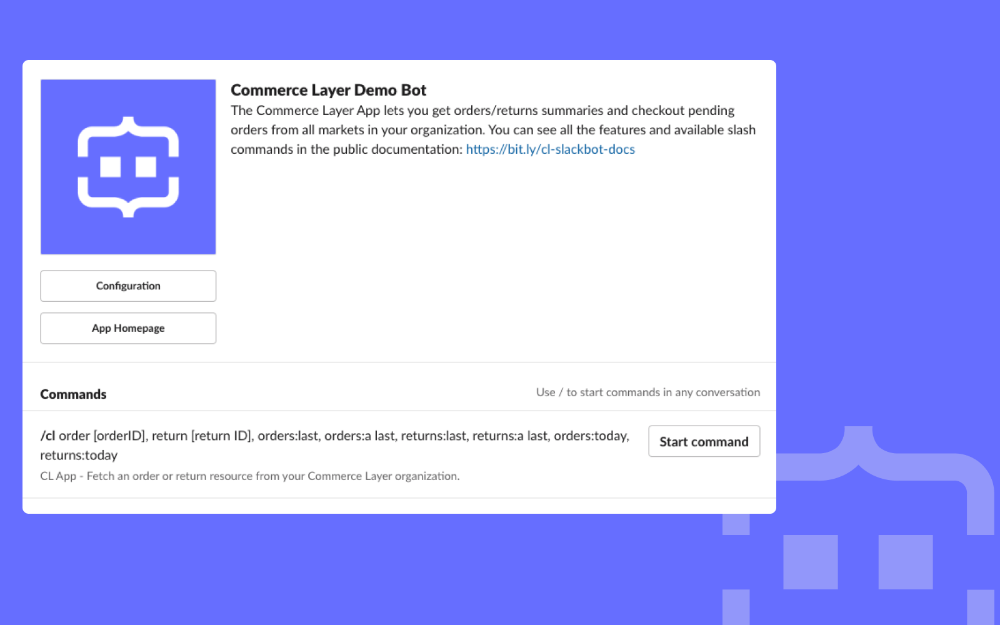

# Commerce Layer Slackbot

This example shows a code implementation of a Slackbot that responds with orders/returns summaries upon request and allows users to checkout pending orders directly from a Slack channel. This application was built with Commerce Layer, Slack Boltjs library, and Supabase. To get started, kindly read [this comprehensive tutorial](https://commercelayer.io/blog/how-we-built-the-commerce-layer-slackbot-with-node-js-and-slack-api), followed by [this one](https://commercelayer.io/blog/handling-slack-apps-distribution-using-supabase-and-fly-io) on our blog.



---

## Bot Features

- [x] Commands to fetch the details of a particular `order` resource, a link to view the full resource in the dashboard, and the ability to checkout the order.
- [x] Commands to fetch the details of a particular `return` resource and a link to view the full resource in the dashboard.
- [x] Command to fetch the current total number and revenue of orders per day.
- [x] Command to fetch the current total number of returns per day.
- [ ] Automatic alerts for the total revenue of orders at the end of the day/week/month.
- [ ] Automatic alerts for the total number of returns at the end of the day/week/month.

|                      |                          |
| -------------------- | ------------------------ |
|    |     |

## Getting Started

The quickest way to get up and running is to use the "Add to Slack" button below to install the Slack bot into your Slack workspace. Alternatively, you can [install from the Slack app directory](#). After a successful installation, you will configure the bot by providing some required Commerce Layer application credentials.

<div align="center">
    <a href="#" target="_blank" rel="noopener noreferrer">
        
    </a>
</div>

## Configuration Guide

Before you start using the Slackbot, you need to provide some Commerce Layer [application credentials](https://docs.commercelayer.io/core/applications). Kindly follow the steps below to configure the app:

1. Find the app (Commerce Layer Demo Bot) in the "Apps" section of your Slack workspace (most often at the bottom section).

2. You will see the home tab with some welcome information and a "Configure App Credentials" button.

3. Click on that button and provide all the required credentials as seen in the image below.


## Commands Available

This Commerce Layer Slackbot allows you to request certain resources by ID and other conditions. The returned response would be a summary of the requested resource with a link to view the resource(s) and checkout `pending` orders (for the `order` resource). The section below explains the available command and what they do.

### Fetch an order resource

Here are the available commands:

- `/cl order [order ID]` (fetch an order by ID)
- `/cl orders:last` and `/cl orders:p last` (fetch the last `placed` order)
- `/cl orders:a last` (fetch the last `approved` order)

These commands will return the following [Order](https://docs.commercelayer.io/core/v/api-reference/orders) and [Customer](https://docs.commercelayer.io/core/v/api-reference/customers) attributes: `id`, `placed_at`, `formatted_subtotal_amount`, `number`, `status`, `payment_status`, `fulfillment_status`, `shipping_address`, `billing_address`, `payment_method`, `shipment_number`, and `customer_email`.

### Fetch a return resource

Here are the available commands:

- `/cl return [return ID]` (fetch a return by ID)
- `/cl returns:last` and `/cl returns:r last` (fetch the last `requested` return)
- `/cl returns:a last` (fetch the last `approved` return)

These commands will return the following [Return](https://docs.commercelayer.io/core/v/api-reference/returns) and [Customer](https://docs.commercelayer.io/core/v/api-reference/customers) attributes: `id`, `created_at`, `number`, `status`, `origin_address`, `destination_address`, `stock_location`, and `skus_count`.

### Fetch the current total orders per day

The `/cl orders:today [currency code]` command will return:

- The total number of `placed` orders from all markets.
- The total number of placed orders from a market (based on the provided currency code).
- The total revenue for all orders.

> **Note**
>
> We ask for the currency code so we can return accurate aggregated reveneue per market due to differences in each market's currency.
>
> The aggregated report data are from between 00:00 o'clock till the time when the request is made.

### Fetch current returns per day

The `/cl returns:today` command will return the total number of `requested` returns from all markets.

## Installation Guide

If for any reason you want to set up your own server (most likely because you want to contribute to this project), kindly follow the steps below.

1. Create a [Commerce Layer account](https://dashboard.commercelayer.io/sign_up), set up your organization, and create the required commerce data resources for your market. You can follow the [onboarding tutorial](https://docs.commercelayer.io/developers/welcome/onboarding-tutorial) or [manual configuration guide](https://docs.commercelayer.io/developers/welcome/manual-configuration) to achieve this.

2. Create a demo Slack workspace and create a [new Slack app](https://api.slack.com/apps/new) (you can [read this Slack guide](https://slack.dev/bolt-js/tutorial/getting-started) to learn the basics of Slack applications).

3. Create a [Supabase account](https://app.supabase.com) and setup a new database project.

4. Clone this repository ([learn how to do this](https://docs.github.com/en/github/creating-cloning-and-archiving-repositories/cloning-a-repository)).

5. Rename the `/.env.example` file to `.env` and add the following credentials:

| **Variable**              | **Description**                        |
| ------------------------- | -------------------------------------  |
| `APP_MODE`                | This indicates if the instance of the project is in `development` or `production`. In production the credentials used are unique for all users sourced from a database while development using the local `.env` file.                       |
| `SLACK_BOT_TOKEN`         | This is a [Slack bot token](https://api.slack.com/authentication/token-types#bot) that represents a bot associated with the app installed in a workspace.                    |
| `SLACK_SIGNING_SECRET`    | This is the unique string key Slack generates for an app and is used to [verify requests](https://api.slack.com/authentication/verifying-requests-from-slack#about) from Slack with confidence by verifying signatures using the signing secret.                                                              |
| `SLACK_CLIENT_ID`         | This is required along with the client secret to make Slack `oauth.v2.access` requests.                     |
| `SLACK_CLIENT_SECRET`     | This is required along with the client ID to make Slack `oauth.v2.access` requests.                         |
| `SLACK_STATE_SECRET`      | This is used to avoid forgery attacks by passing in a unique value to encode and decode the state when a Slack `oauth.v2.access` request is made. You should enter a random pre-defined string here.                                 |
| `SLACK_APP_TOKEN`         | This is a [Slack app-level token](https://api.slack.com/authentication/token-types#app) that represents an app across organizations, including installations by all individual users on all workspaces in a given organization.                     |
| `CL_ORGANIZATION_ENDPOINT` | Your Commerce Layer organization endpoint.                                                            |
| `CL_ORGANIZATION_MODE`     | A string value that indicates the mode of your Commerce Layer account (the Developer plan is `test` and the [Growth and Enterprise plan](https://commercelayer.io/pricing) is `live`). This is used for external link routing to the dashboard.    |
| `CL_CLIENT_ID`             | Your Commerce Layer integration application client ID.                                               |
| `CL_CLIENT_SECRET`         | Your Commerce Layer integration application client secret.                                           |
| `CL_CLIENT_ID_CHECKOUT`    | Your Commerce Layer sales channel application client ID.                                               |
| `SUPABASE_URL`             | The API URL for your Supabase project (`https://your-project-id.supabase.co`).                             |
| `SUPABASE_ANON_KEY`        | The anon key used when a user is not logged in for "anonymous access" during Supabase PostgREST API requests.                                                            |

> **Note**
>
> For all Commerce Layer credentials, see: <https://docs.commercelayer.io/core/applications>.
>
> For all Slack credentials, see: <https://api.slack.com/authentication>.
>
> For all Supabase credentials, see: <https://supabase.com/docs/guides/database>.

6. This project uses `pnpm`; [install pnpm](https://pnpm.io/installation) first, and run the command below to install the required dependencies:

```bash
pnpm install
```

7. Run the command below to automatically compile all TypeScript files into the `/build` folder with the same file structure:

```bash
pnpm run dev-build
```

8. Run the command below to start the Nodejs server:

```bash
pnpm run dev-start
```

9. Run the command below to start a [Ngrok](https://ngrok.com/download) server on port 3000; this will generate a URL (like `https://f09d-2a09-bac5.eu.ngrok.io`) proxied to `http://localhost:3000`.

```bash
pnpm run dev
```

10. Update your Slack app accordingly with the generated URL above or use these [manifest (JSON or YAML)](./manifests/) files as a template to easily [configure your Slack app](https://api.slack.com/reference/manifests).

<br />

Now you can proceed to do your thing!

---

> **Note**
>
> If you want to deploy this application to fly.io, kindly refer to the deployment section of [this tutorial](https://commercelayer.io/blog/handling-slack-apps-distribution-using-supabase-and-fly-io). For other deployment providers, you can deploy this like any other Nodejs app.
