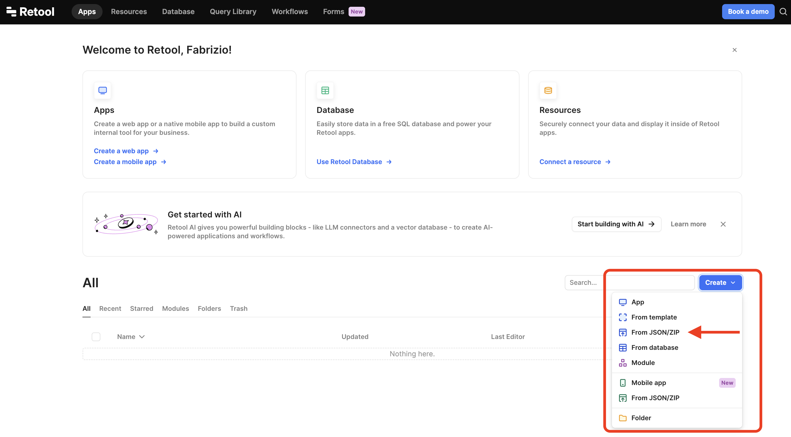

# metrics-api-retool-dashboard

This example contains a sample Retool Dashboard that can be used to display Commerce Layer Metrics API data.
To import it just open the retool dashboard and on the **create** button select *from JSON*.

You will probably need to **rewrite the code elements** containing the queries as the ones imported won't work (they refer to the orginal resources). The blog article contains detailed instructions on how to do that!

